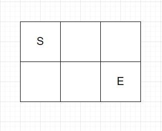
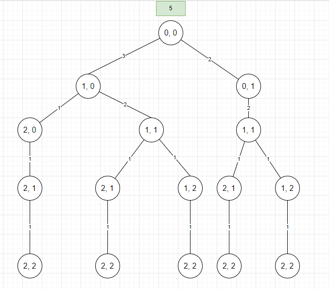

這個問題中，將得到一個網格，想要做的是從左上角向下移動到右下角，這裡要返回可能遍歷該網格的方式數量，網格需要注意的是我們只能向右或向下移動，這意味著我們可以向上而不能向左移動。

下圖為一個範例



第一種走法是

```
r, r ,d
```

```
 ______ ______ ______
|      |      |      |
|   S  |   r  |   r  |
|______|______|______|
|      |      |      |
|      |      |   E  |
|______|______|______|
```

第二種是

```
r, d, r
```

```
 ______ ______ ______
|      |      |      |
|   S  |   r  |      |
|______|______|______|
|      |      |      |
|      |   d  |   E  |
|______|______|______|
```

第三種是


```
d, r, r
```

```
 ______ ______ ______
|      |      |      |
|   S  |      |      |
|______|______|______|
|      |      |      |
|  d   |   r  |   E  |
|______|______|______|
```

總共是三總可能的走法。

如果條件對於網格而外給予一堵牆的條件，則結果會不同

```
 ______ ______ ______
|      |      |      |
|   S  |      |   W  |
|______|______|______|
|      |      |      |
|      |      |   E  |
|______|______|______|
```

W 表示牆，所以路徑選擇上不會穿過這堵牆。則結果會有兩種路徑。

1. r, d, r
2. d, r, r

假設給予 3 * 3 網格的範例
```
       0       1      2
     ______ ______ ______
    |      |      |      |
 0  |      |      |   W  |
    |______|______|______|
    |      |      |      |
 1  |      |      |      |
    |______|______|______|
    |      |      |      |
 2  |      |      |      |
    |______|______|______|
```

>橫軸為 column，縱軸為 row

下面顯示了決策後的樹狀圖，並從 `(0, 0)` 網格作為起點開始。





`(2, 2)` 為終止條件，回傳 1。結果會是由上往下傳值，以 `(1, 1)` 節點來看可往 `(2 ,1)`、`(1, 2)` 節點走，因此其值會是 $1+1$，最終可以得到 5 個路徑的走法。

以 Brute Force 遞迴來觀察複雜度，`c` 表示 cols；`r` 表示 `rows`。

time: $O(2^{r+c})$

space: $O(r+c)$

但從該樹可以看到重複的子問題，可以透過動態規劃方式來進一步優化。

使用 memoization 方式後複雜度可優化

time: $O(r*c)$

space: $O(r*c)$