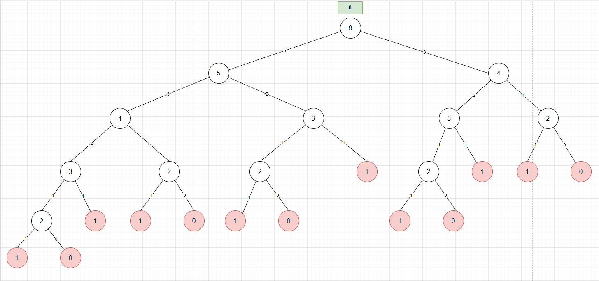
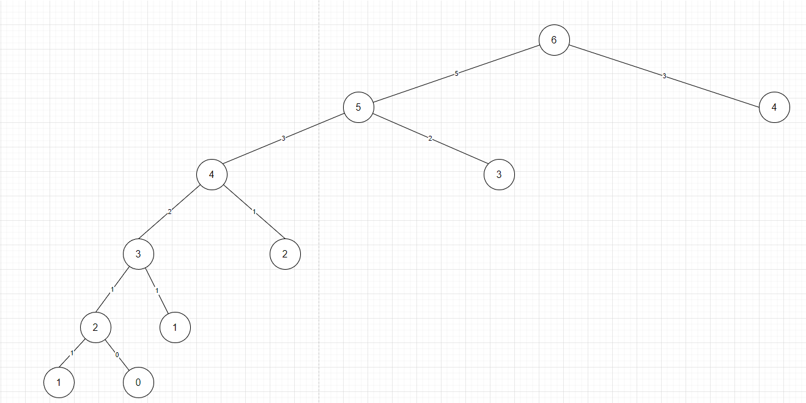

Fibonacci 範例

```
0 1 1 2 3 5 8 13 21 ...
```


以函式表示：

```
fib(n): 0 1 1 2 3 5 8 13 21 ...
```

fib(0) = 0,
fib(1) = 1,
fib(2) = 1,
fib(3) = 2,
fib(4) = 3,
fib(5) = 5,
fib(6) = 8,
fib(7) = 13,
fib(8) = 21

第 0 個 fibonacci 數字是 0；第 2 個 fibonacci 數字是 1；第 7 個 fibonacci 數字是 13。

以第 6 個 fibonacci 數字來看，$fib(6) = 8 =  fib(5) + fib(4)$，其可以推導出 $fib(n) = fib(n-1) + fib(n-1)$。下圖樹狀結構顯示其關聯，父問題是從子問題而來



$fib(0) = 0$ 和 $fib(1) = 1$ 是基本條件，也可以說是在樹狀上的終止條件。對於節點為 2 的值，可以從子樹的結果相加獲取，所以 $fib(2) = fib(1) + fib(0) = 1 + 0 = 1$。

該樹狀結構會是以遞迴方式由下往上傳遞值，那其複雜度又是如何 ?

以時間複雜度來看，每個節點都要花費時間，而樹的節點是 $2^n-1$

time：$O(2^n)$

>執行演算法所需要耗費的時間成本

對於遞迴的結構，程式通常是以堆疊方式執行，樹的階層就是其複雜度

space：$O(n)$

>執行時所花費的記憶體空間成本

進而觀察上面樹狀圖發現其實對與子問題有很多重複的過程，以左邊的 4 節點和右邊的 4 節點來看就是一樣的問題。該問題可透過 `memoization` 方式來優化，其可以是 `HashTable` 或是 `Map` 等資料結構，這樣就可以對樹進行減枝，如下圖：



memo table:

| Key| value|
|---|---| 
|2|1|
|3|2|
|4|3|
|5|5|

對於左側為 4 的節點，其 2 子節點可以從 momo 表獲取該值，節點 5 也是。最後可以獲得

time：$O(n)$

space：$O(n)$