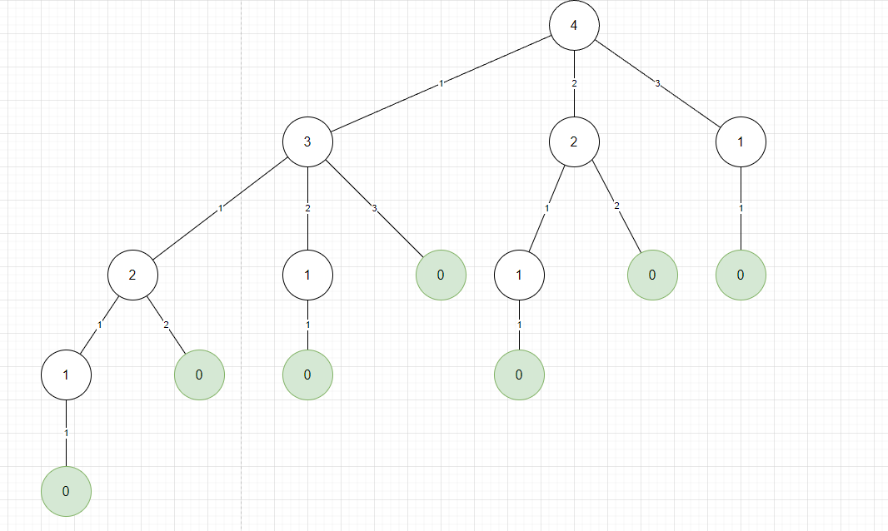
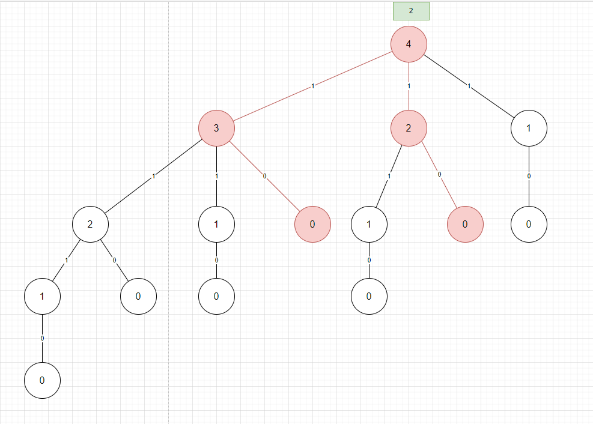

給定一個金額和一些硬幣值的數組，最後返回的是創建金額所需的最小硬幣數量。
```
amount = 5
coins = [1, 2, 3]
```

例如，目標金額是 5，所以可以達到 5 的方法是
- 1 + 1 + 1 + 1 + 1
- 2 + 2 + 1
- 1 + 1 + 3
- 3 + 2 

最後是選擇需要最少數量硬幣的方式，因此 `3 + 2` 只使用兩個硬幣，最後回傳值也就是 2。


下圖使用以下條件作為範例

```
amount = 4
coins = [1, 2, 3]
```

使用樹結構可以獲得下圖，並且可以清楚知道路徑，像是 4 -> 3 -> 1 -> 0 這個路徑是使用 3 個硬幣完成。



對於上圖的顯示，其終止條件是

```
if amount == 0
    return 0;
```

計算路徑方式如下圖所示，因為是遞迴，會從最底下的子節點進行計算。由於父節點要的是最短路徑或是最小數量硬幣，因此會在父節點下的節點進行比較，以左下的 2 節點來看子節點 1 和 0 會選擇 0，但還需要做的實際上是將其加 1 以計算最短路徑，因此往父節點傳時會在加 1。



以 Brute Force 複雜度來看，$c$ 表示 coins 數量，$a$ 表示 amount

time: $O(c^a)$

space: $O(a)$


觀察樹後會出現同樣的子節點，此時可以透過動態規劃方式進行優化。以 Dynamic Programming with Memoization 來看

time: $O(c*a)$

space: $O(a)$