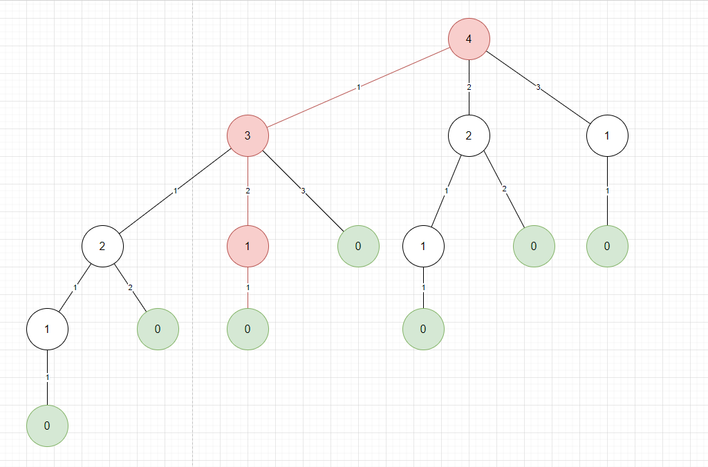
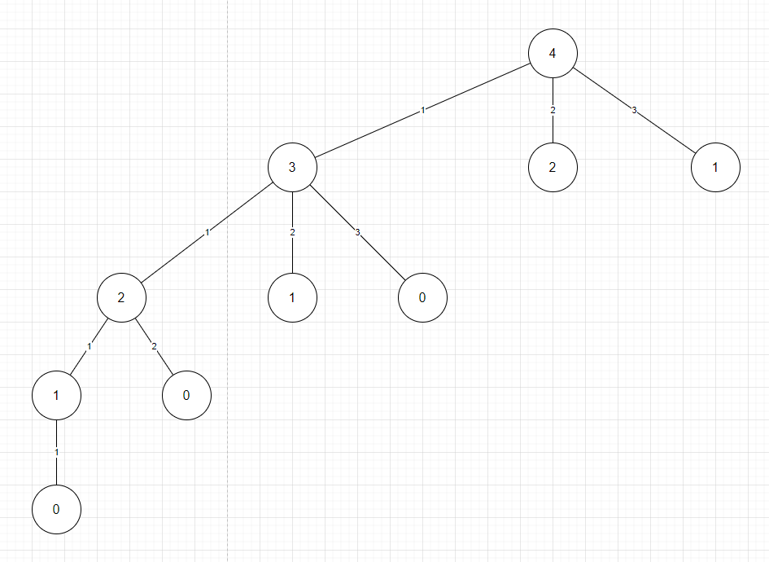
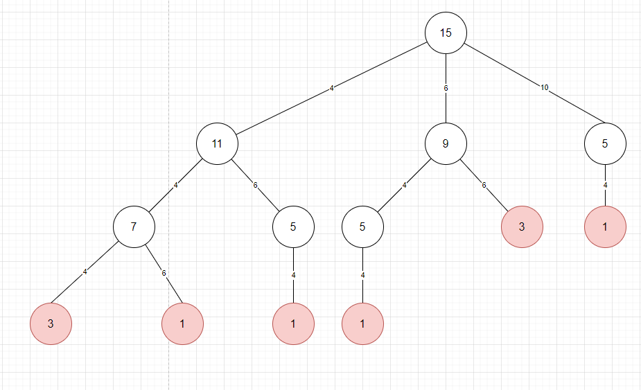

接受兩個參數，其一是金額以和一個充滿數字的數組，想要做的是返回 `true` 或 `false` 表示是否可以使用數組中的某些數字來產生在這個特定的例子中，透過將它們加在一起，可以透過將數組中的一些數字相加來完全得到 5 則返回 true。

### Case 1

amount = 5,
numbers = [1, 2, 3]

```
2 + 3
3 + 1 + 1
2 + 1 + 2
1 + 1 + 1 + 1 + 1
```

### Case 2

amount = 15,
numbers = [6, 4, 10]

沒有組成方式


以下面例子來看

amount = 4,
numbers = [1, 2, 3]

可以獲取以下決策樹，線上的數字表示從 `numbers` 獲取的元素，而節點值則是父節點減掉元素的值的結果。



其節點為 0 時，則為終止條件。

```java
if amount == 0 
    return true
```

從根節點到 0 節點的整個權重相加則為一個可行的條件。以節點 4 到節點 3 到節點 1 到節點 0，這過程的權重相加為 $1 + 2 + 1 = 4$，符合 `amount`。

以 Brute Force 複雜度來看

a = amount
n = length of numbers

time: $O(n^a)$

最糟情況就是 `a` 

space: $O(a)$

同樣的，上圖有重複的子樹，可以使用動態規劃方式優化，最後的樹會被剪枝成



time: $O(n*a)$

space: $O(a)$


下面是一個回傳 false 的案例

amount = 15
numbers = [4, 6, 10]

