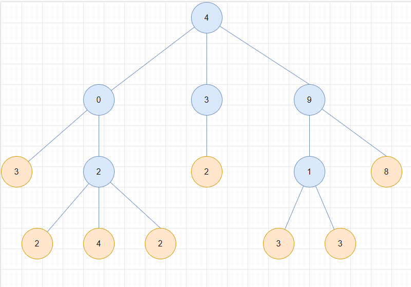
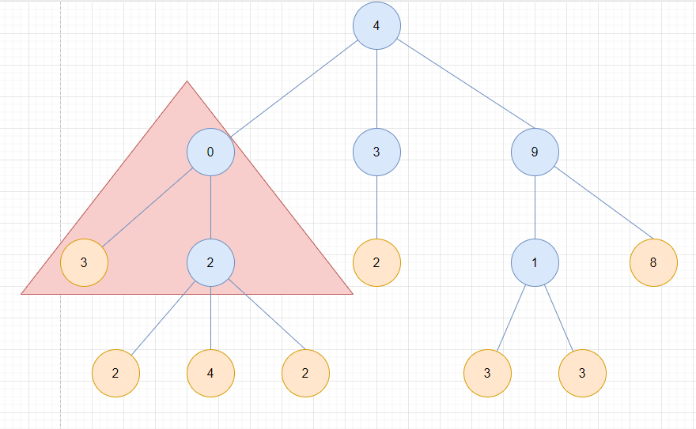

樹(tree) 是一個無向圖，可以滿足以下條件

- 無環的連接圖
- N 個節點，且 N-1 條邊
- 任何兩個節點，該兩個節點之間只有一條路徑

對於一個樹來說，會有一個最頂層的頂點可以稱為 `root node`。如果每有任何一個被定義的根節點，則任何一個節點都可視為根。

一個子節點會是另一個節點的延伸，則該節點的上層節點就為父節點。

葉節點(leaf node)是一個沒有子節點的節點。

以下面的樹來看，4 為根節點。第二層的節點 0 有 3、2 兩個子節點，和父節點 4。葉節點則為下圖橘色的節點。




子樹(subtree)是一個樹，完全包含在另一棵樹中的一棵樹。通常使用三角形表示，如下圖所示。

>子樹可能由單一節點組成



## What is a Binary Tree(BT) ?
Binary Tree 是一個樹，其每個節點最多有兩個節點。


```
     1
    / \
   /   \
  5     8
```


```
          1
         / \
        /   \
       0     8
      / \     \  
     /   \     \
    5     4     6
```

## What is a Binary Search Tree (BST) ?

Binary Search Tree 是 Binary Tree，此外還滿足二元搜尋，左邊節點小於父節點；右邊節點大於父節點。

```
     2
    / \
   /   \
  1     3
```

```
          8
         / \
        /   \
       6     9
      / \     \  
     /   \     \
    2     7     11
```

## Where used ?
- BST
    - map 和 set 資料結構上實作
    - Red Black Trees
    - AVL Trees    
    - Splay Trees
    - etc...
- binary heaps
- Syntax trees
- Treap

## BST 複雜度

| Operation | Average | Worst |
|---|---|---|
|Insert|$O(log(n))$|$O(n)$|
|Delete|$O(log(n))$|$O(n)$|
|Remove|$O(log(n))$|$O(n)$|
|Search|$O(log(n))$|$O(n)$|

## Insert elements to BST
BST 節點要是能夠被比較的。當要插入節點可以如下決策

- 遞迴左子樹 (<case)
- 遞迴右子樹 (>case)
- 處理找到的重複值 (=case)
- 建立節點


```
insert(1)
insert(2)
insert(3)
insert(4)
insert(5)
```

```
1
 \
  \
   2
    \
     \
      3
       \
        \
         4
          \
           \
            5
```

此種插入是線性的行為，不是一個很好的方式。而平衡樹可以解決此問題。

## Removing elements from BST
可以使用以下進行決策

1. 找到要刪除元素，如果存在
2. 將要刪除的節點替換為其後繼節點，以保持 BST 狀態。

### 查找階段
1. 遇到一個空節點，此時知道該值在 BST 中不存在
2. 比較值，如果是 0 表示找到
3. 比較值，如果是小於 0 表示找到，存在於左子樹
4. 比較值，如果是大於 0 表示找到，存在於右子樹

### 刪除階段
有四個場景

1. 移除葉子節點
其不存在子樹

2. 要刪除的節點有右子樹，但沒有左子樹

3. 要刪除的節點有左子樹，但沒有右子樹

4. 要刪除的節點有左子樹、右子樹
