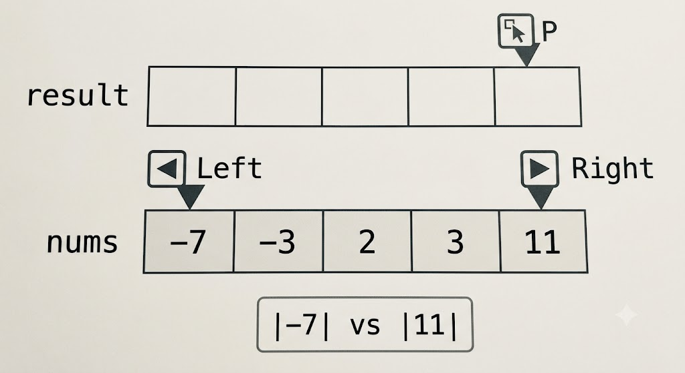
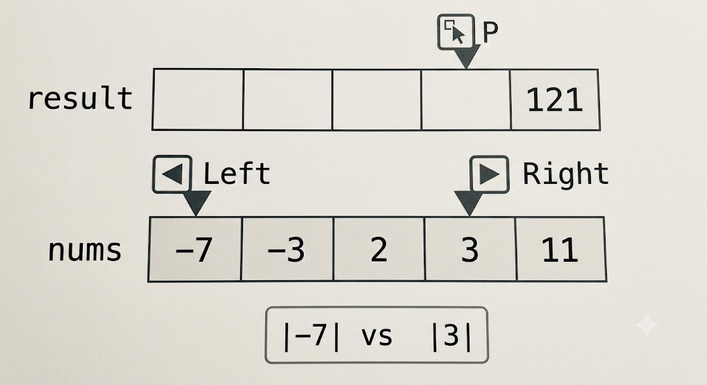
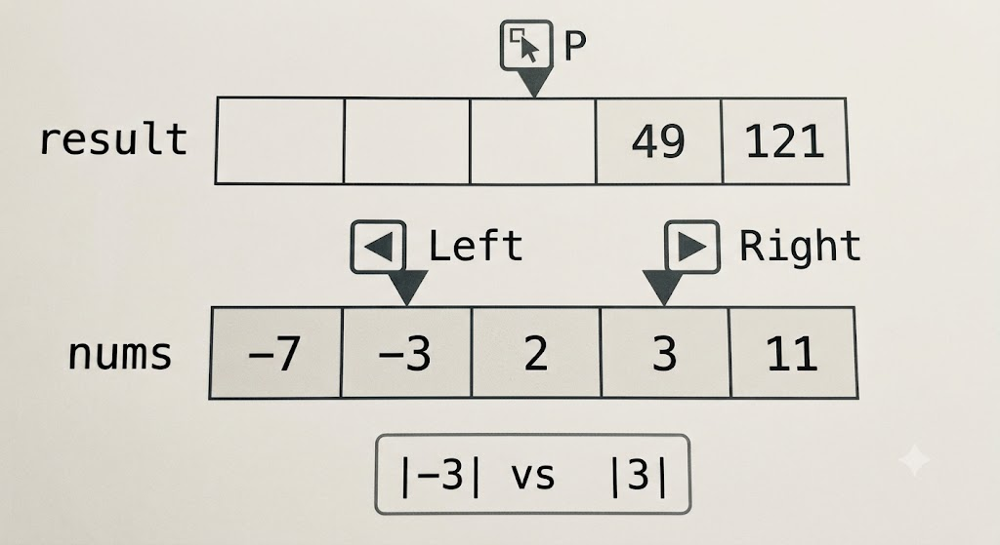
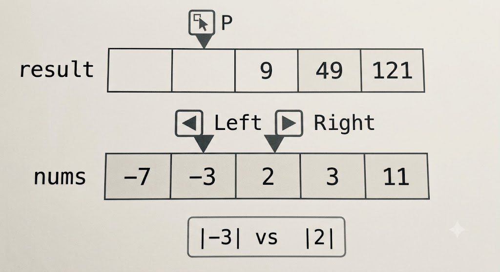
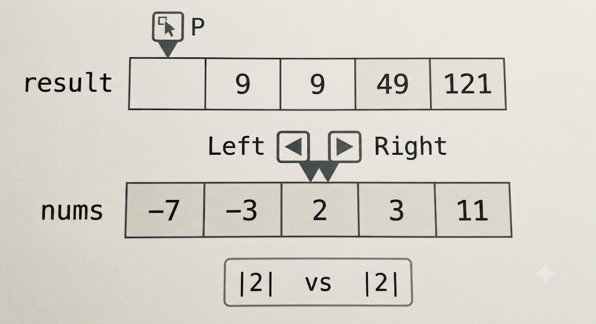
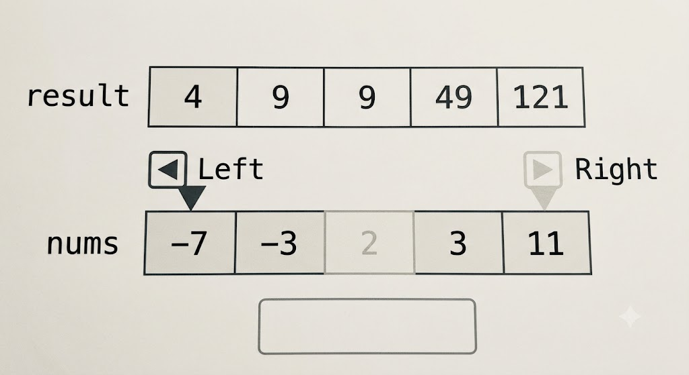

# 977. Squares of a Sorted Array

Given an integer `array` nums sorted in non-decreasing order, return an array of the squares of each number sorted in non-decreasing order.

**Example 1:**
```
Input: nums = [-4,-1,0,3,10]
Output: [0,1,9,16,100]
Explanation: After squaring, the array becomes [16,1,0,9,100].
After sorting, it becomes [0,1,9,16,100].
```
**Example 2:**
```
Input: nums = [-7,-3,2,3,11]
Output: [4,9,9,49,121]
``` 

**Constraints:**

- 1 <= nums.length <= $10^4$
- $-10^4$ <= nums[i] <= $10^4$

nums is sorted in non-decreasing order.
 

Follow up: Squaring each element and sorting the new array is very trivial, could you find an $O(n)$ solution using a different approach?

## Solution

使用雙指針（Two Pointers），從陣列的兩端向中間包抄，只要 $O(n)$ 的時間複雜度就能搞定。題目要點是陣列原本就是排好序的，平方後的極值（最大值），一定會出現在原本陣列的最左端（絕對值很大的負數）或最右端（很大的正數）。

**java**

```java
class Solution {
    public int[] sortedSquares(int[] nums) {
        int n = nums.length;
        int[] res = new int[n];
        int left = 0;
        int right = n - 1;
        int index = n - 1;
        while (left <= right) {
            int num1 = nums[left] * nums[left];
            int num2 = nums[right] * nums[right];
            if (num1 <= num2) {
                res[index] = num2;
                right--;
            } else {
                res[index] = num1;
                left++;
            }
            index--;
        }
        return res;
    }
}
```

**go**

```go
func sortedSquares(nums []int) []int {
    n := len(nums)
    res := make([]int, n)
    index := n - 1
    right := n - 1
    left := 0
    for left <= right {
        num1 := nums[left] * nums[left]
        num2 := nums[right] * nums[right]
        if num1 <= num2 {
            res[index] = num2
            right--
        } else {
            res[index] = num1
            left++
        }
        index--
    }
    return res
}
```


## 圖解

我用視覺化的方式，一步步拆解使用雙指針法對 `[-7, -3, 2, 3, 11]` 進行平方排序的過程。


準備好原始陣列 `nums`，一個空的結果陣列 `result`。

* `left` 指針指向 `nums[0]` (-7)。
* `right` 指針指向 `nums[4]` (11)。
* `p` 指針指向 `result` 的末尾 (index 4)，準備填入最大的數。




### 步驟一：比較 -7 和 11

現在開始第一輪比較。

* `Left` 指針的值是 -7，平方後是 **49**。
* `Right` 指針的值是 11，平方後是 **121**。

因為 121 (來自 `Right`)大於 49，所以我們把 121 填入 `result[p]`（最後一個位置）。

* **動作**：將 `result[4]` 設為 121。
* **移動**：`Right` 指針向左移一格，`p` 指針向左移一格。


---

### 步驟二：比較 -7 和 3

進入第二輪比較。此時：

* `Left` 指針的值依然是 -7，平方後是 **49**。
* `Right` 指針現在指向 3，平方後是 **9**。

這次 49 (來自 `Left`)大於 9。所以我們把 49 填入 `result[p]`（index 3）。

* **動作**：將 `result[3]` 設為 49。
* **移動**：`Left` 指針向右移一格，`p` 指針再向左移一格。


---

### 步驟三：比較 -3 和 3

第三輪比較。此時：

* `Left` 指針移到了 -3，平方後是 **9**。
* `Right` 指針依然指向 3，平方後也是 **9**。

當兩者相等時，我們可以任選一個。這裡我們假設選擇了 `Right` 的 3（這在程式碼實作中通常取決於條件判斷式是 `>=` 還是 `>`）。我們把 9 填入 `result[p]`（index 2）。

* **動作**：將 `result[2]` 設為 9。
* **移動**：`Right` 指針向左移一格，`p` 指針再向左移一格。


---

### 步驟四：比較 -3 和 2

第四輪比較。此時：

* `Left` 指針依然指向 -3，平方後是 **9**。
* `Right` 指針移到了 2，平方後是 **4**。

9 (來自 `Left`)大於 4。所以我們把 9 填入 `result[p]`（index 1）。

* **動作**：將 `result[1]` 設為 9。
* **移動**：`Left` 指針向右移一格，`p` 指針再向左移一格。


---

### 步驟五：處理最後一個數 2

現在進入最後一步。`Left` 和 `Right` 指針現在重疊了，都指向 2。

* 2 的平方是 **4**。

我們把這個最後的 4 填入 `result[p]` 唯一剩下的空位（index 0）。

* **動作**：將 `result[0]` 設為 4。

現在，`result` 陣列已經被完全填滿，並且是由小到大排序好的平方數：`[4, 9, 9, 49, 121]`。演算法結束。

